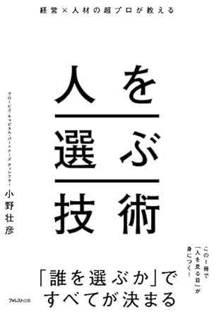
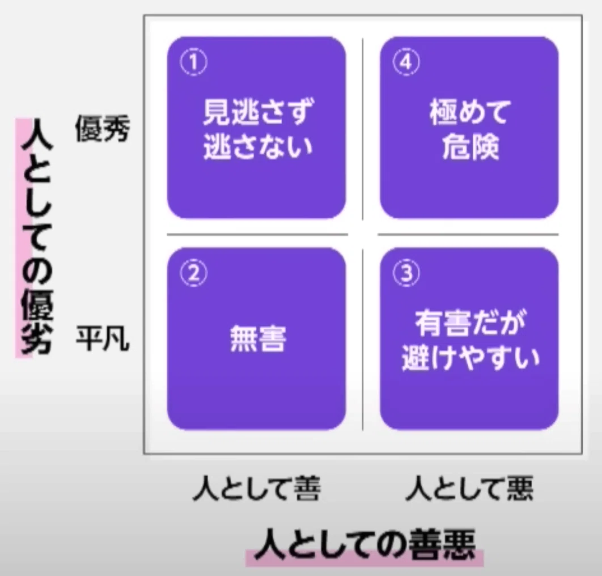

# 書籍: 人を選ぶ技術を読んだ

ユウト @yossydev

---

## Profile

- Name: ユウト
- Field: Web Developer
- Blog: [yossy.dev](https://yossy.dev/)
- SNS / Youtube: [@yossydev](https://twitter.com/yossydev)

---

---

# どんな本？

--- 

## どんな本？

採用/恋愛/人付き合いにおいての、「良い人を見極める方法」が言語化された本

---

## 例えば

- コンピテンシーで、相手の将来の行動を予測する
- ポテンシャルで、相手の器を見る
- ソースオブエナジー、使命感や劣等感から

---

---

## 階層ごとに、その人が理想の人なのかを見極める

---

# 2. Evilな人を見極める

---

---

## 見極め方

- Evilな人には「ナルシスト」と「マウント」タイプがある
- Evilな人はサイコパス気質が高い
- サイコパスな人は瞬きの回数が以上に少ないらしい
- 共感性がも欠如している
- 何かがおかしいと感じたらアラート

---

# 読んだきっかけ

---

## 読んだきっかけ

- トレーナー業をやった際に、僕の評価と周りの人の評価が異なることがあった
- 見てるポイントが、僕は1Fだったのに対し、周りの人は1F < B1F < B2F < B3F違った
- 目線を合わせたかった

--- 

## 読んで良かったところ

- 意識して自分を一度客観的に見るようになる
- リーダー人の苦悩がわかる

--- 

# 一年の振り返りも兼ねて、読んでみることをお勧めします！

あと逆におすすめの本あれば教えてください！