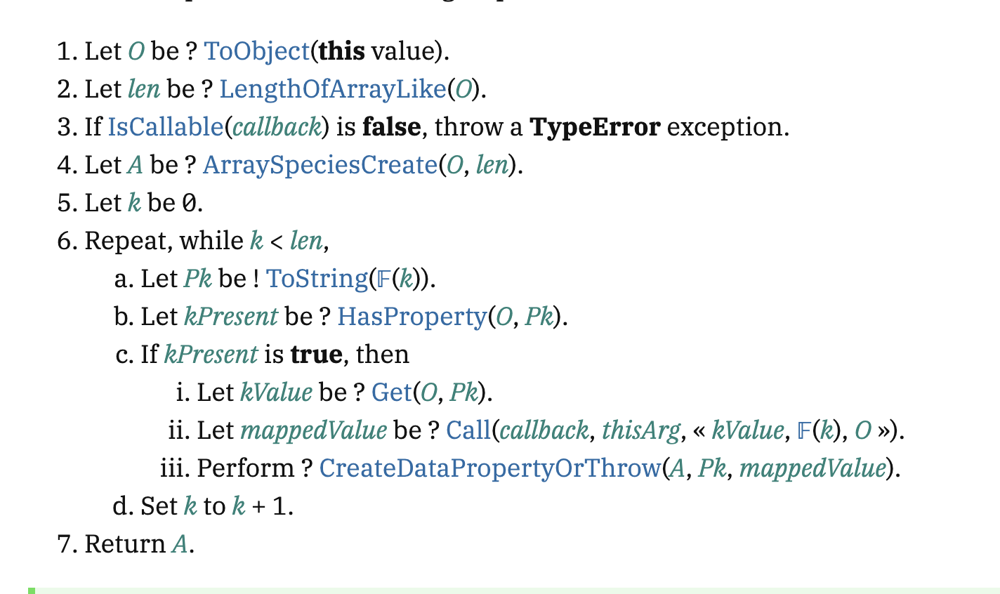

# 普段使っているAPIが現場に届くまで

**yossydev**
フロントエンドカンファレンス東京 x Vue Fes Japan

---

## 今日話すこと

フレームワークではなく、皆さんが**当たり前のように使っているAPI**たちがどのように生み出されているのか

OSS活動を軸に話していきます

---

## 問題提起

フレームワークとかツールチェイン、いわゆるエコシステムな物を追い続けるのは体力がいる。

効率よく追えるような知識あった方が生成AI時代には良いのでは。

---

## でもよく考えてみてください

どんなフレームワークを使っても、結局は`Array.map()`や`fetch()`を使っていますよね？

---

## 根本を知る重要性

「また新しいの？」
↓
**「ああ、これはあれのラッパーね」**

技術選定の軸を作りましょう

---

## APIの分類

よく使われる3つのAPIを例に：

- `Array.prototype.map`
- `console.log`
- `fetch`

実はこれらには**出生地の違い**があります

---

## 3つの種類

そしてこれらのAPIには、以下のような違いがあります。

- **Array.prototype.map**: JavaScript Engine（ECMA-262）
- **console.log**: Runtime（WHATWG/WinterTC）
- **fetch**: Runtime（WHATWG/WinterTC）

---

# Engine系APIの実装現場

---

## Array.prototype.map の場合

- **JavaScript Engine**が持っているAPI
- 仕様書：**TC39のECMA-262**
- 有名なEngine：
  - Google V8
  - Apple JavaScriptCore
  - Mozilla SpiderMonkey

---

## 私の取り組み：Nova

- **Nova** JavaScript Engineにコントリビュート
- 「なんで作るのか？」→「**作りたいから**」
- Test262通過率：**75%**
- 主要Engine：90%超え

---

## Test262とは

ECMA-262の仕様書通りにAPIが作られているかをチェック

最近RegExpに取り組み中
来月には**80%**に行きそう

---

## Array.prototype.mapの実装を覗いてみる

---

## Novaの実装

https://github.com/trynova/nova/blob/73a35f81b30c95fcca269644529fdb5d4165421c/nova_vm/src/ecmascript/builtins/indexed_collections/array_objects/array_prototype.rs#L1944

- 結構愚直
- mapはcallbackを受け取るメソッドなので、jsとrustの言語差による違いがあって最適化が難しい
- spider monkeyだと、callbackをjitコンパイル時にバイナリとしてインライン展開するようにすることで最適化を行う（確かそうだったはず）

---

# Runtime系APIの実装現場

---

## Runtime経由での実行

ただ、皆さんは普段どのランタイムがどのEngineを使っているかなんて意識しないですよね。ましてやEngineをcloneして手元でAPIを実行するみたいなこともしないですよね。

おそらく9割くらいの人は、EngineのAPIを**Runtime経由**で実行していると思います。

---

## JavaScript Runtimeといえば？

**ブラウザ**：
- Chrome（V8）
- Safari（JavaScriptCore）

**サーバーサイド**：
- Node.js（V8）
- Deno（V8 + Rust）
- Bun（JavaScriptCore + Zig）

---

## 私の取り組み：Andromeda

- **Andromeda** JavaScript Runtime開発メンバー
- NovaをベースとしたサーバーサイドRuntime
- WinterTC Invited Expert
- 目標：**minimal common API**の実装

---

## fetchの実装

- fetchの仕様は膨大
- Request/Response/Headerクラスもfetchの範囲
- fetch methodからfetching/main fetch/schema fetch/http fetch/http network fetchみたいな分類になっている

---

## fetchのRuntime実装を覗いてみる

https://fetch.spec.whatwg.org/

---

## Andromedaのfetch実装

https://github.com/tryandromeda/andromeda/blob/main/runtime/src/ext/fetch/fetch/mod.ts

- 本来は全てRustで書きたいし書けると思うがNovaが全てのapiを公開していないのでtsで書いてます。
- 最近までテストがなく、自分でテストを書いたりしていたが流石にしんどくなってきたので[wpt runner](https://github.com/tryandromeda/andromeda/pull/117)を作った
- 大きな実装は終え、ここからはnetwork系の処理を作っていく

---

## コントリビュートのすすめ

**サーバーサイドRuntimeがおすすめ**：

- Engineの実装は複雑（前提知識が必要）
- Runtime（特にNode）は仕様書通りの実装
- fetchにはTODOも残っている

---

# エコシステム戦略

---

## まとめ

3つのAPIの出生地：
- **JavaScript Engine/Runtime**によって作られる
- Engine仕様：**ECMA-262**
- Runtime仕様：**WHATWG/WinterTC**

---

## 普及への課題

特定課題解決ライブラリ → 必然的にユーザー増加

しかし**Runtimeは特殊**：
- Bunのような圧倒的な速さが必要
- Andromedaは理論上早いが検証段階

---

## エコシステム戦略

**既存エコシステムに乗っかる**のが最速

日本で最もホットなJSソフトウェアは？

**Hono**のAdaptorとして提供が目標

---

## 仕様書からコードへ：開発者の視点

**仕様書を読むときのコツ**：
1. **Step番号**に注目 → コードの処理順序
2. **抽象操作**を理解 → 実装の関数呼び出し
3. **エラーケース**を確認 → Exception処理

**実装を読むときのコツ**：
1. **コメント**で仕様書のステップを確認
2. **テストケース**で挙動を理解
3. **エラーハンドリング**でエッジケースを把握

---

## 実践的な学習方法

**engineでもruntimeでもいいので、コードと仕様書を見比べてみましょう。**

おすすめアプローチ：
1. 気になるAPIの仕様書を読む
2. 実装コードを探して読む
3. コードを少しいじってテストを走らせる
4. 仕様書とコードの対応を確認

実際に手を動かすと理解が深まります！

---

## クロージング

EngineとRuntimeの挙動を知ると：
- 知らないJavaScriptの挙動を発見
- **めっちゃ楽しい！**

ぜひ皆さんも興味があれば触ってみてください！

---

## Thank you!

質問があれば気軽にどうぞ 🙋‍♂️

**yossydev**

---

<small>※このスライドはスピーカーノートを元にAIに作成してもらいました</small>
